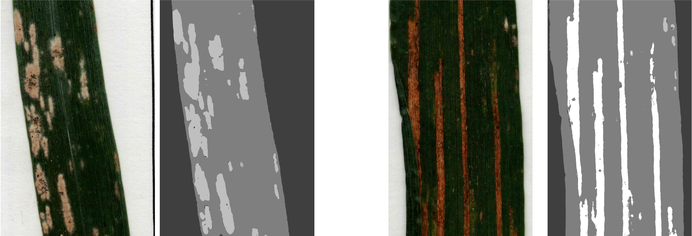

<!----------------------------------------------------------------------->

<!----------------------------------------------------------------------->

<table width="100%" style="border: none;">
  <tr>
    <td align="left" style="border: none;"><b>LE GOURRIEREC Titouan</b></td>
    <td align="left" style="border: none;"></td>
    <td align="right" style="border: none;">
      
      
      <!--  -->
    </td>
  </tr>
</table>

<!----------------------------------------------------------------------->
<!----------------------------------------------------------------------->

<!-- PROJECT LOGO -->
 

  <!--  -->

  <h3 align="center">EasIlastik </h3>

  

    A package to facilitate the use of image segmentation model trained on Ilastik in Python
     
    <a href="https://github.com/titouanlegourrierec/EasIlastik/wiki"><strong>Explore the docs »</strong></a>
     
     
    <!-- <a href="https://github.com/othneildrew/Best-README-Template">View Demo</a>
    ·
    <a href="https://github.com/othneildrew/Best-README-Template/issues/new?labels=bug&template=bug-report---.md">Report Bug</a>
    · -->
    <a href="https://github.com/titouanlegourrierec/EasIlastik/issues">Report a bug · Request Feature</a>
  

<!-- TABLE OF CONTENTS -->

  
Table of Contents

  <ol>
    <li>
      <a href="#about-the-project">About The Project 📖</a>
      <ul>
        <li><a href="#built-with">Built With 🛠️</a></li>
      </ul>
    </li>
    <li>
      <a href="#getting-started">Getting Started</a>
      <ul>
        <li><a href="#prerequisites">Prerequisites</a></li>
      </ul>
    </li>
    <li><a href="#usage">Usage</a></li>
    <li><a href="#license">License</a></li>
    <li><a href="#contact">Contact</a></li>
    <li><a href="#acknowledgments">Acknowledgments</a></li>
  </ol>

<!----------------------------------------------------------------------->
<!----------------------------------------------------------------------->

## About The Project

  

This package provides seamless integration of pre-trained image segmentation models from Ilastik into Python workflows, empowering users with efficient and intuitive image segmentation capabilities for diverse applications.

<!----------------------------------------------------------------------->

(<a href="#readme-top">back to top</a>)

<!----------------------------------------------------------------------->

### Built With
* [![Python][Python-badge]][Python-url]
* [![OpenCV][OpenCV-badge]][OpenCV-url]
* ![Shell Script][ShellScript-badge]

<!----------------------------------------------------------------------->

(<a href="#readme-top">back to top</a>)

<!----------------------------------------------------------------------->

## Getting Started
### Prerequisites 

* Ilastik software: To train your own model for image segmentation, pleae download the Ilastik software tailored to your computer's operating system from: https://www.ilastik.org/download.

### Train a model

* To train your own model on Ilastik and properly adjust the different parameters, please refer to [this documentation](https://github.com/titouanlegourrierec/EasIlastik/wiki/Train-a-model-on-Ilastik).

<!----------------------------------------------------------------------->

(<a href="#readme-top">back to top</a>)

<!----------------------------------------------------------------------->

## Usage

For usage examples of this package, please refer to the [Example Notebook](https://github.com/titouanlegourrierec/EasIlastik/blob/1be43ebb76bccec6917e05367fbb7e48b184efdc/Examples/example-notebook.ipynb)

<!----------------------------------------------------------------------->

(<a href="#readme-top">back to top</a>)

<!----------------------------------------------------------------------->

<!-- ROADMAP -->
<!-- ## Roadmap

- [x] Add Changelog
- [x] Add back to top links
- [ ] Add Additional Templates w/ Examples
- [ ] Add "components" document to easily copy & paste sections of the readme
- [ ] Multi-language Support
    - [ ] Chinese
    - [ ] Spanish

See the [open issues](https://github.com/othneildrew/Best-README-Template/issues) for a full list of proposed features (and known issues).

(<a href="#readme-top">back to top</a>)
 -->

<!-- CONTRIBUTING -->
<!-- ## Contributing

Contributions are what make the open source community such an amazing place to learn, inspire, and create. Any contributions you make are **greatly appreciated**.

If you have a suggestion that would make this better, please fork the repo and create a pull request. You can also simply open an issue with the tag "enhancement".
Don't forget to give the project a star! Thanks again!

1. Fork the Project
2. Create your Feature Branch (`git checkout -b feature/AmazingFeature`)
3. Commit your Changes (`git commit -m 'Add some AmazingFeature'`)
4. Push to the Branch (`git push origin feature/AmazingFeature`)
5. Open a Pull Request

(<a href="#readme-top">back to top</a>)
 -->

## License

Distributed under the GNU License like the Ilastik software. See [`LICENSE`](https://github.com/titouanlegourrierec/EasIlastik/blob/1be43ebb76bccec6917e05367fbb7e48b184efdc/LICENCE) for more information.

<!----------------------------------------------------------------------->

(<a href="#readme-top">back to top</a>)

<!----------------------------------------------------------------------->

## Contact

LE GOURRIEREC Titouan - [titouanlegourrierec@icloud.com](mailto:titouanlegourrierec@icloud.com)

Repository Link: [https://github.com/titouanlegourrierec/EasIlastik](https://github.com/titouanlegourrierec/EasIlastik)  
Pypi Link : [https://pypi.org/project/EasIlastik/](https://pypi.org/project/EasIlastik/)

<!----------------------------------------------------------------------->

(<a href="#readme-top">back to top</a>)

<!----------------------------------------------------------------------->

## Acknowledgments

* [Ilastik Software](https://www.ilastik.org) : An interactive interface to annotate images to segment.

<!----------------------------------------------------------------------->

(<a href="#readme-top">back to top</a>)

<!----------------------------------------------------------------------->

<!-- MARKDOWN LINKS & IMAGES -->

[Python-badge]: https://img.shields.io/badge/python-3670A0?style=for-the-badge&logo=python&logoColor=ffdd54
[Python-url]: https://www.python.org

[OpenCV-badge]: https://img.shields.io/badge/opencv-%23white.svg?style=for-the-badge&logo=opencv&logoColor=white
[OpenCV-url]: https://opencv.org

[ShellScript-badge]: https://img.shields.io/badge/shell_script-%23121011.svg?style=for-the-badge&logo=gnu-bash&logoColor=white